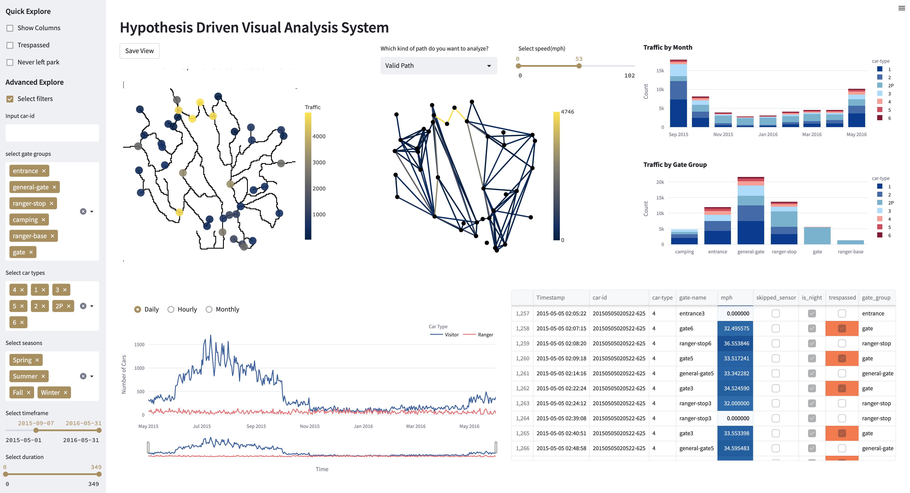

# VAST Challenge 2017 Visual Analytics Dashboard

Interactive Streamlit dashboard for the 2017 VAST Challenge, developed for a visual analytics class. This project serves as an exploratory tool, utilizing Streamlit to gain and present insights into the VAST challenge data.

## Web App

The Streamlit web app can be accessed [here](https://vast-dashboard.streamlit.app/).

## Running the App Locally

1. Clone the repository.
2. Navigate to the cloned directory.
3. Install the required libraries using: `pip install -r requirements.txt`
4. Run the Streamlit app with: `streamlit run main.py`

